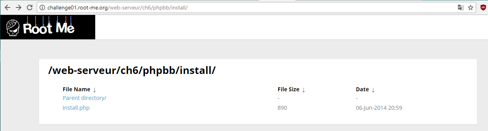

# Install files

15 Points
You know phpBB

Переходим на сайт с таском и видим пустую страницу. Открываем html-код и видим 
```html
<!--  /web-serveur/ch6/phpbb -->
```
Перейдя по этому адресу, снова видим пустую страницу. Подсказка говорит, что надо искать установочные файлы системы для разработки форумов phpbb. С помощью Google-поиска мы узнали, что phpbb создает при установке папку install. Посмотрим, есть ли она.

Открываем файл install.php и видим флаг.