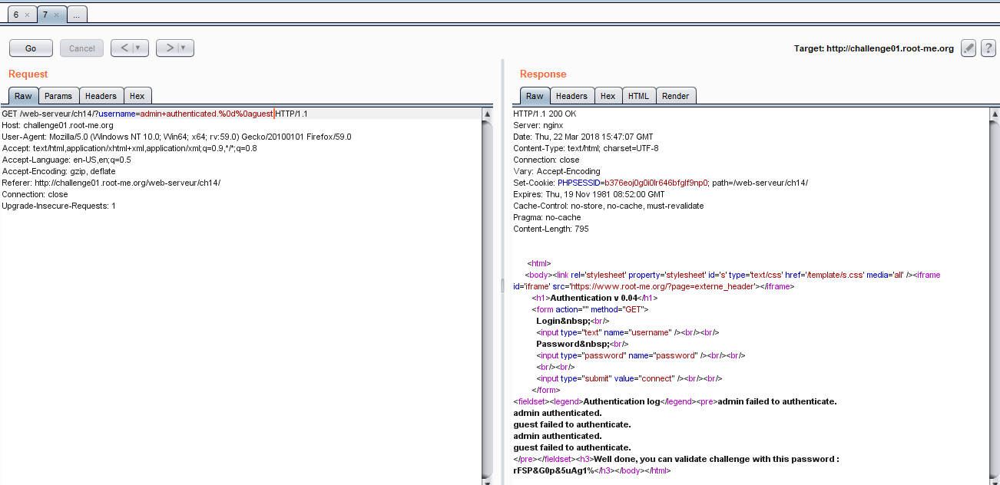

# CRLF
20 Points

>Statement
>
>Inject false data in the journalisation log.

Сайт с формой для авторизации. Пробуем войти. Не получается и видим, что внизу есть лог попыток аутентификации. По подсказке догадываемся, что нам нужно, чтобы в логе было "admin authenticated.". Для этого составим запрос, где в параметре username впишем символы новой строки cr и lf. В URI-кодировке они выглядят как %0d%0a. Итоговый вид запроса: 

```
GET /web-serveur/ch14/?username=admin+authenticated.%0d%0aguest
```



Ура мы получили флаг!