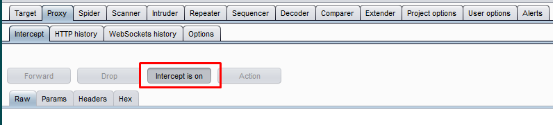
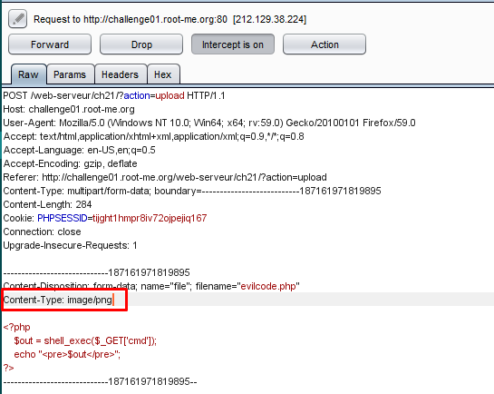
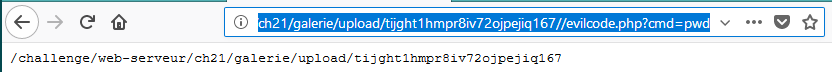
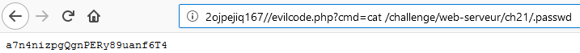

# File upload - MIME type

20 Points
Gallery v0.03

> Statement
>
> Your goal is to hack this photo galery by uploading PHP code.
>
>  Retrieve the validation password in the file .passwd.

Задание похоже на предыдущее. Только теперь фильтрация графических файлов происходит по заголовку Content-Type в POST-заголовке. Код тот же, только файл назовем с расширенимем php -  evilcode.php. Настроим Burp на перехват запросов.

Загружаем файл на сервер и переходим в Burp, где меняем Content-Type.

Файл успешно загрузился. Теперь перейдем по нему с GET-параметром *cmd* равным *pwd*, чтобы узнать, в какой директории мы находимся.

По аналогии с предыдущим заданием выведем содержимое файла *.passwd*, который лежит в корне веб-приложения.
