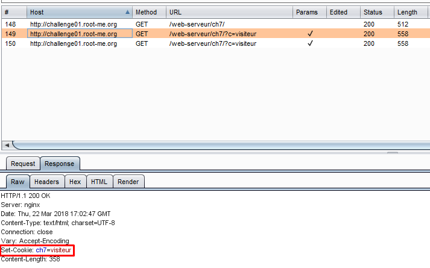
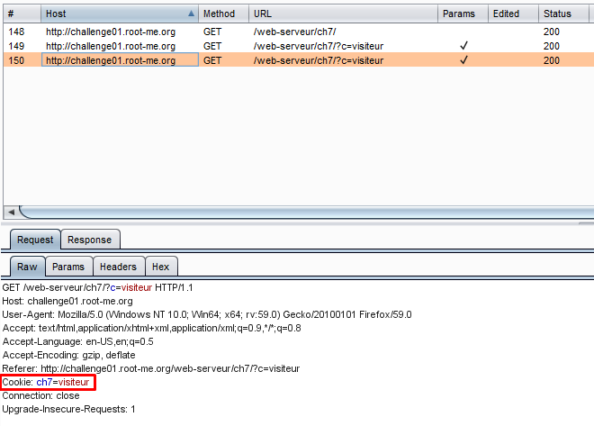
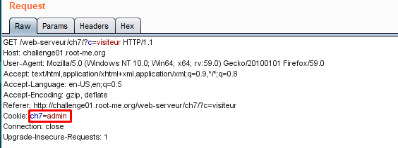

# HTTP cookies

20 Points 
Bob create a script to gather user’s email...

> Statement
>
> PS : Bob really love cookies

Таск, как понятно по названию связан с манипуляциями куками. Весь траффик будем пускать через Burp. Изучая веб-приложение, тыкаем на ссылку *Saved email address*. В burp видим, что нам дали куку ch7=visiteur.

Теперь следующий запрос к сайту будет идти вместе с этой кукой.

Отправим этот запрос в Repeater и изменим куку таким образом: ch7=admin

В response получили флаг.