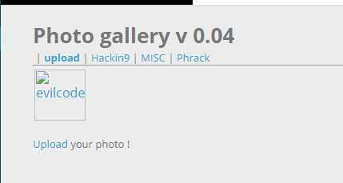

# File upload - null byte

25 Points
Gallery v0.04

По аналогии с предыдущими заданиями на загрузку файла на сервер, нам также нужно загрузить зловредный код. В этом задании происходит фильтрация по расширению и Content-Type. Название таска дает нам подсказку. Если мы передадим файл evilcode.php%00.png, то на сервере создастся файл evilcode.php, обрезая всё, что за нулевым байтом.

Перейдем по нему и получим флаг.