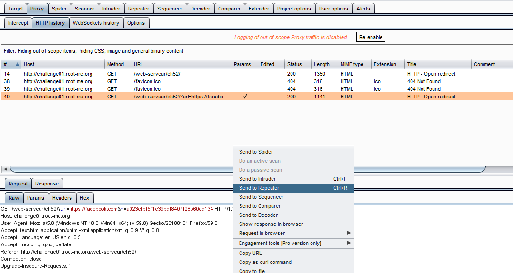
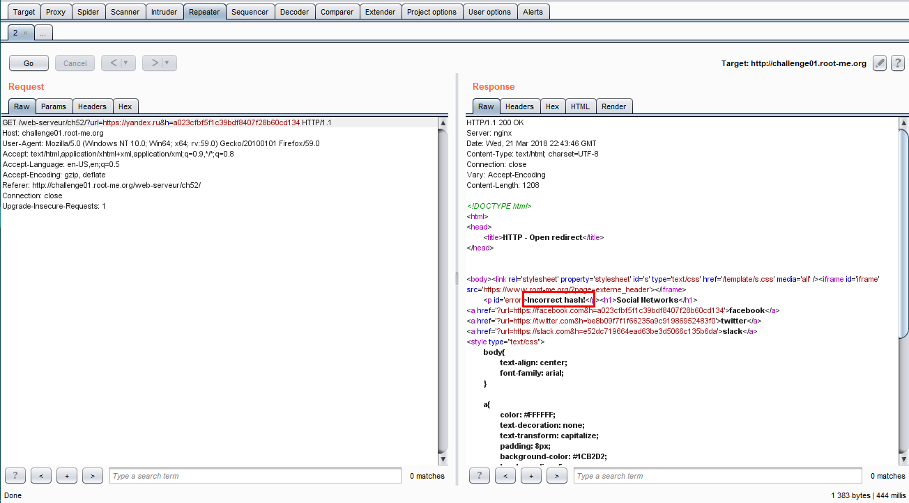
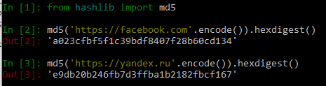
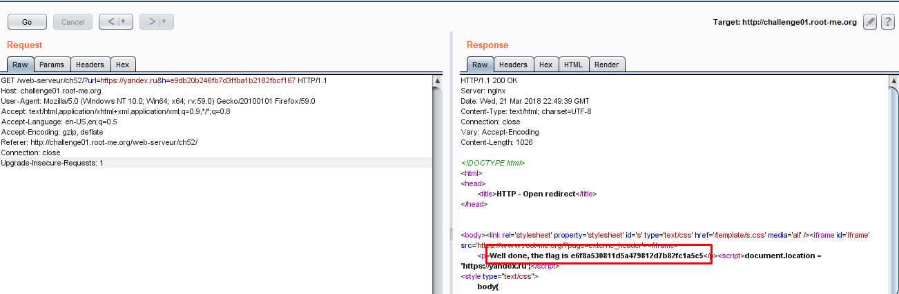

# HTTP - Open redirect
10 Points
Internet is so big

Видим, что редирект, например, происходит при нажатии на одну из трех кнопок, одна из которых имеет ссылку

?url=https://facebook.com&h=a023cfbf5f1c39bdf8407f28b60cd134.

Первый GET-параметр как несложно догадаться - сайт, на который происходит редирект. Попробуем его изменить не трогая пока параметр h. Используем Burp, чтобы перехватить запрос, который мы затем отправляем в Repeater.

Там мы изменяем параметр url. Пусть будет https://yandex.ru. Отправляем и видим строку Incorrect hash.

Видимо GET-параметр h - это хэш параметра url. Проверяем. Хэш имеет длину 32 hex-символа, следовательно это md5. С помощью языка python и его модуля hashlib получаем хэш строки https://facebook.com. Видим, что полученный хэш совпадает с хэшом, который передавали при переходе на facebook.

Находим md5-хэш от строки https://yandex.ru, составляем и соответствующий запрос. Получаем флаг.

