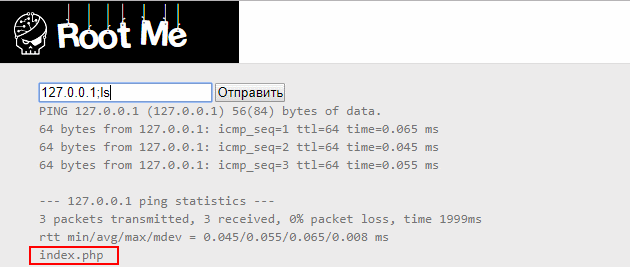
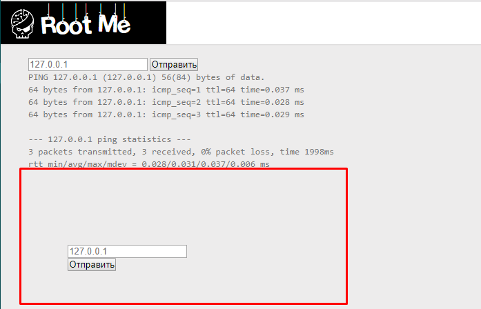
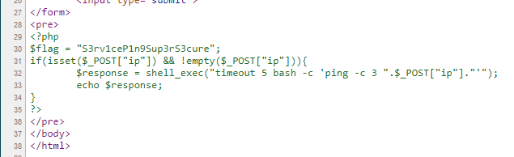

# Command injection
10 Points

Ping service v1

>Statement
>
>Find a vulnerabilty in this service and exploit it.
>
>The flag is on the index.php file.

Видим поле с ip-адресом. Нажимаем кнопку "отправить". Под инпутом появляется вывод команды ping. Предположим, что выполняется строка *ping IP-адрес*. Попробуем поставить точку с запятой и выполнить еще одну команду. То есть впишем в поле "127.0.0.1;ls" (без кавычек). Видим, что выполнилась команда ls.

Попробуем вывести содержимое файла index.php, вписав в инпут "127.0.0.1;cat index.php". Браузер рендерит содержимое index.php.

Посмотрим на html-код.

