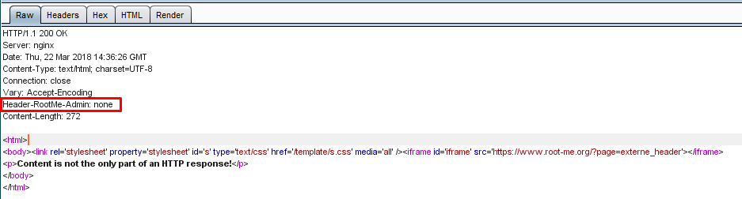
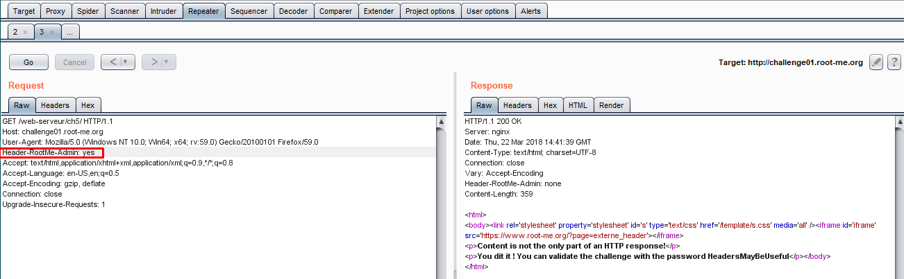

# HTTP Headers

15 Points
HTTP response give informations

> Statement
>
> Get an administrator access to the webpage.

Переходим на страницу таска. Нам говорят, что содержимое это не только то, что рендерит браузер. Смотрим хедеры через Burp.

Видим нестандартный заголовок Header-RootMe-Admin со значением none. Попробуем через Repeater отправить тот же запрос, но с заголовком Header-RootMe-Admin: yes.

Ура! Мы получили флаг.