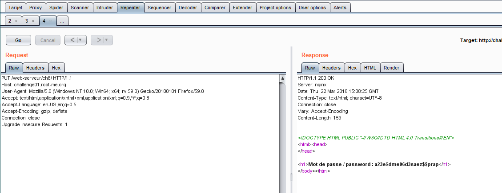

# HTTP verb tampering

15 Points 
HTTP authentication

> Statement
>
> Bypass the security establishment.

Переходим на сайт с таском. Нас заставляют пройти аутентификацию. Исходя из названия таска, попробуем получить ту же страницу, но не GET-методом. Будем перебирать HTTP-методы. Пробуем метод PUT

Ура! Мы получили флаг.